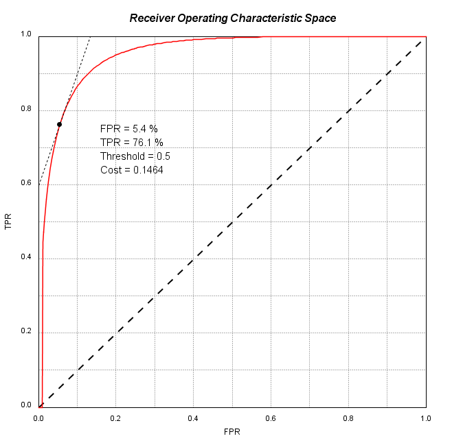

Handling ROC curves with roc4j
===================

The package roc4j is designed for estimating and handling Receiver Operating Characteristics (ROC) curves of binary classifiers in JAVA. Among its main features, it contains:

- ROC curve computation
- ROC curve filtering and smoothing
- Confidence bands computation
- Graphical plots (exportable in png, svg, jpg...)
- Validation process handler
- Optimal operating points computation

This tutorial on roc4j main functionalities is organized as follows: the first part is a theoretical introduction to ROC curves in machine learning, then second part is a quick start explanation on how to estimate and plot a ROC curve on a simulated simple model of classifier. Third part deals with more advanced capabilities such as statistical smoothing of curves, confidence bands computation or plot export. Eventually, last part provides a complete example on a real problem addressed with Naive Bayes classifier.

### Table of contents

[TOC]

----------

Theoretical Introduction
-------------

```math 
a + b = c
```

In this section we will consider data as elements of $\mathcal{X} \times \mathcal{Y}$, where $\mathcal{X}$ denote the space of features (most of the time $\mathcal{X} \subset \mathbb{R}^d$ where $d$ is a given dimension), and $\mathcal{Y}$ is the output space. The goal of classifier, is to use a training dataset $\{(x_i,y_i)\}$ and to build a model to be able, given a new instance $x_{new}$ whose label $y_{new}$ is unknown, to infer the posterior probability of $y_{new}$ : $\mathbb{P}[y_{new}|x_{new}]$. Then, $y_{new}$ is inferred as :

$$\hat{y}_{new} = \underset{y \in \mathcal{Y}}{\mbox{argmax}}~\mathbb{P}[y~|~x_{new}]$$

Let's provide a simple example. Imagine we are trying to build a classifier to recognize hand written characters. Each character is a 12 x 12 pixel grey-level image and, for each instance, we would like the classifier to tell us which figure (between 0 and 9) is depicted. To do so, we have a training dataset, composed of 1000 images, for which the label is known (i.e. for each image we have an associated target value, equal to the number depicted on the image). 

On this example, the input space $\mathcal{X}$ is equal to $\{0,255\}^{144}$, if we consider that each pixel is coded on 8 bits, i.e. $2^8 = 256$ levels. Each image contains $12\times12 = 144$ pixels, meaning that it is described by $144$ integer values between $0$ and $255$. The output space is simplier, since any image depicts one of the ten numbers : $\mathcal{Y} = \{0,1,2,3,4,5,6,7,8,9\}$. 

Then a classifier must be trained on the 1000 images to recognize numbers depicted on figures or, more formally, given a new instance $x_{new}$, decide which label $y_{new} \in \mathcal{Y}$ is the most likely :

$$\mathcal{C} : \mathcal{X} \longrightarrow \mathcal{Y}  ~~~~~~~~~~~~~~ \\  ~~~~~~~~~ 
x_{new} \longrightarrow y_{new} = \mathcal{C}(y_{new}) $$

Hereafter, we consider only binary classifiers, i.e. classifiers for which output (or target) space $\mathcal{Y}$ contains only two modalities, that we will denote $0$ and $1$, without any loss of generality. An instance which is labelled $y = 0$ will be arbitrarily called *negative instance*, while label $y=1$ will be refered as *positive instance*. 

It is important to note that while the task of a classifier is to predict the outbut value $y_{new}$ of a new instance $x_{new}$, it may be very interesting as well to know to what degree of confidence this decison has been made, i.e. the posterioir probability value of $y$ conditionned to the data feautures: $\mathbb{P}[y_{new}|x_{new}]$.

For example, let us consider the task of detecting cats in color images. Input space $\mathcal{X}$ is equal to $[0,255]^{3r}$ where $r \in \mathbb{N}$ is the image resolution, and $3$ stands for the $3$ color channels: red, green and blue. This is not much different from figure recognition task. However, output space, will be now reduced to two classes, denoted as positive (when a cat is depicted on the picture) and negative (otherwise): $\mathcal{Y} = \{0,1\}$. Given a new image $x_{new}$, our classifier must return a prediction $\hat{y}_{new}$ with an associated confidence level. For example: if a cat has been detected on the image with $85$% confidence level:

 $$\hat{y}_{new} = 1 \\ \mathbb{P}[y_{new}|x_{new}] = 0.85$$

The second row in the equation above may be interpreted as a *classification score*. With that in mind, a classifier $\mathcal{C}$ is no longer expected to return a binary value in $\mathcal{Y}$, but rather a score in $[0,1]$, which tells us that the instance $x$ is all the more likely to be labelled $y=1$ as this score is high.  As a consequence, a classifier may be thought of as projection on a uni-dimensionnal space, where positive and negative instances are well separated. This is not very different from the main axis resulting from a *Principal Components Analysis*, which seeks to project multi-dimensional data in a lower dimension space while keeping as much variance between data as possible. The only differences are that here 1) we are not interested in preserving variance between instances but only between positive and negative class instances, and 2) the projection space is not necessarily a linear combination of original dimensions. 


The figure above provides an example of the result of operating a classifier, where green curve depicts the distribution of positive instances while red curve is the distribution of negative instances. We may see that the two distributions are rather well separated, which was not necessarily the case in the original input space $\mathcal{X}$. Of course, we shall note that these distributions are overlapping each other, and it might be difficult to label correctly an instance when its score is between, say $0.3$ and $0.7$. The size of the overlap region depends 1) on the discriminating power of the algorithm and 2) on the real separation of instances. For example, if we consider a case where data are hardly separable, we might end up with the scoring space representation below, on which we may observe that it will be very difficult to discriminate instances on a wide range of scores. For example, even with a confidence level of $80$%, only about two third of data seem to be actually positive instances. 


On the opposite, we may consider the case where data have been very well separated by the classifier (possibly because the data were easily separable in their original space, or also because the classifier found a very discriminating projection space). This results in a small overlap area, and a reduced risk of making wrong predictions.


Now that we have understood how data are distributed in the scoring space, let us explain how predictions are made. We know that positive instances (green) are rather located on the right part of the scoring space (high scores) while negative instances (red) are mostly located on the other side. Of course positive and negative labels have completely symmetric roles, and they can be easily exchanged. 

A basic and quite straightforward idea to separate classes, would be to draw a vertical line in the middle of the plot depicted on the figure above, and to associate each data on the right of the line with the label $y = 1$, the other instances being labelled $y = 0$. Then it remains the question: where should we place this threshold $t$ in $[0,1]$. A rational solution would be to choose $t$ at the abscisssa where green and red curves intersect. This is a very consistent choice because it ensures that each instance is classified as the dominant label of instances in the training dataset that had the same score. For example, in the above plot, we would choose $t \simeq 0.57$, then an instance whose score is equal to $0.5$ would be classified as negative, since at the $0.5$ abscissa, red curve is dominant compared to greeen curve, or more explicitely, among training data instances whose score is equal to $0.5$ most of them are negative. 

However, this is not always as simple, and sometimes, the optimal decision threshold is following some more complex considerations that may be fully dependent on the problem we are trying to solve. To understand why, let us consider the two types or errors that may occur when classifying an instance.

- We talk about a **false positive** detection when a given negative instance has been predicted as positive.
- We talk about  **false negative** detection when a given positive instance has been predicted as negative.

On the above plots, false positive instances correspond to red (negative) instances which are located on the right of the decision threshold line. Conversely false negative instances correspond to green (positive) instances which are located on the left of the decision threshold line. Obviously, the more overlap between green and red curves, the higher these two numbers are likely to be. 

Based on these considerations, we may define two quantities :

- The **False Positive Rate** (FPR), equal to the number of instances detected as positive out of the total number of negative instances (or simply put, it is the fraction of area of the red curve which is located on the right part of the decision threshold).
- The **True Positive Rate** (TPR), equal to the number of instances detected as positive out of the total number of positive instances (or simply put, it is the fraction of area of the green curve which is located on the right part of the decision threshold).

It is important to note that both these quantites are fractions of area on a given (red or green) curves. Unlike some other indices (such as precision for example), TPR and FPR are not dependent upon class's mixing proportions, *i.e.* they will not be affected if we apply our classifier on a different population where the ratio of positive out of negative instances is different. 

However, FP and TP rates depend on the position of the treshold $t$, and as we might expect, they are both decreasing as the threshold increases (higher treshold means stricter classifier, then fewer positive instances are detected but false positive become more and more unlikely). 

As a consequence, to a given threshold is associated an operating point (FPR, TPR), and plotting points resulting from all thresholds $t$ ($0 \leqslant t \leqslant 1$), would make a curve, that we call *Receiver Operating Characteristics* curve. We provide an example of ROC curve hereafter.


More formally, we may observe that as being the fraction of area of the red curve which is located on the right part of the decision threshold $t$, FPR may be expressed as:

$$FPR(t) = 1-F(t)$$

where $F : [0,1] \rightarrow [0,1]$ is the cumulative distribution function (cdf) of negative instances in the scoring space. 

$$F(t) = \int_0^tf(s)ds$$

where $f : [0,1] \rightarrow \mathbb{R}$ is the probability density function of scores returned by the classifier for a negative instance (red distribution).

With the same reasoning, and denoting $G$ the cdf of positive instances, TP rate is simply expressed as:

$$TPR(t) = 1-G(t)$$

By eliminating the threshold $t$ in the previous two expressions, we get an explicit formulation of ROC curve:

$$TPR = 1-G(F^{-1}(1-FPR))$$

Or alternatively, in the ROC space where $x$ and $y$ denote false and true positive rates, respectively:

$$y(x) = 1-G(F^{-1}(1-x))$$

Let us analyze extreme situations:

For a completely blind classifier (sheer random decision), we can assume that there is no discrimination between positive and negative instances in scoring space, hence for a sufficient number of data, cumulative distribution functions may be assumed to be equal: $F \simeq G$. As a direct consequence, the ROC curve is expressed as $y(x) = x$, meaning that the diagonal line in the previous plot depicts sheer random classifier. 

On the reverse, a perfect classifier will separate completely positive and negative instances distribution in scoring space, then it is possible to find a treshold $t^{*}$ such that $TPR(t^{*}) = 1$ and $FPR(t^{*}) = 0$, *i.e.* all postive instances are detected with no false positive. This means that the associated ROC curve would touch the upper left corner of the ROC space.

As a general rule, the worst classifiers are close to the diagonal line, and the better a classifier is, the closer its ROC curve will get to the upper left corner, as depicted in the figure herafter, where blue classifier are much more performant than green ones.


If a ROC curve is significantly below the diagonal line, then it means that it tends to associate positive output to negative instances and negative output to positive instances. By inversing output labels, we get a good classifier, and we are back to the standard situation. However, in order to be able to compare multiple classifiers performances, as a general rule, we would try to get all ROC curves in the upper part of the ROC space, even if this is to the expense of reversing output labels for some of the classifiers (of course, in such eventuality, reversing operation is performed for all instances used in the validation of a given classifier). 

We have seen previously that ROC curve are expressed as a combination of cumulative distribution functions. As a consequence, the ROC curve quality of any given classifier is depending on how well one can estimate these cdfs. This does not pose special problems when the validation dataset is large, but when it is not the case (*e.g.* with only a few hundreds of instances left for the validation process) we have to use elaborate technics to get a good estimate of ROC curves, and it then becomes important as well to be able to estimate ROC curve confidence bands to be able to perform significant comparision of classifiers. 

As an illustration, let us consider the following picture, depicting the ROC curves of 3 different models of classifiers, validated on a small dataset (2000 instances or so). The gap between curves is quite huge, but it can be assumed to be significant only after computing bands at 95% confidence level. This enables us to conclude that the green classifier achieves significantly better performance than its red and blue competitors. On a small dataset, such a conclusion would not be possible without uncertainty analysis.


Before going any further, we should clarify what a *small* dataset means. There is no global definition, and it depends on multiple factors, such as the significancy level required from the study, and the difference one expects to observe between different models of classifier. As a general rule, we will consider the uncertainty associated to a proportion (binomial distribution) at 95% level:

$$\varepsilon_{95\%} \simeq \frac{1}{\sqrt{N}}$$

where $N$ is the number of validation samples. This result is obtained by applying Central Limit Theorem (i.e. we suppose that $N \geqslant 30$) on the upper bound situation, where the proportion we want to estimate is equal to 50%. 

If we have a validation dataset containing 100 samples, then every proportion computed, will have a confidence interval equal to $\pm\frac{1}{\sqrt{100}} = \pm 10\%$. For example, if we found that 68% of samples have been correctly classified, taking into account the scarcity of the validation dataset, we must say that the accuracy rate of the classifier is $68~ (\pm 10$) %. Then the real accuracy is somewhere between 58% and 78%. 

As a rule of thumb, we may consider that computing ROC curve confidence bands and/or using refined techniques of ROC curve estimation is necessary when, the differences we want to observe are of the same order of magnitude than $\varepsilon_{95\%}$.

For example, in the previous case, if we have a second classifier whose accuracy is lying somewhere in [58;78], for a validation dataset containing only 100 samples, then it will be necessary to compute ROC curve confidence bands to confirm that the difference between classifier models is (un)significant. 

Then in the picture above, it was necessary to compute confidence bands, since the gap between classifier models is of the same order of magnitude than the confidence bands themselves (of course the widths of confidence bands are not known prior to computation, but $\varepsilon_{95\%}$ is a good rough estimate).

So, we observed that the definition of a small dataset does not depend only on the number of instances. For example, a given dataset may be considered as small to compare the blue and red classifiers, while it is large enough to make sure that green classifier is better than blue classifier. 

Note: if the dataset is markedly imbalanced (between negative and positive instances), then it would be better to consider $\varepsilon_{95\%}$ for each distribution:

$$\varepsilon_{95\%}^+ \simeq \frac{1}{\sqrt{N^+}}$$
$$\varepsilon_{95\%}^- \simeq \frac{1}{\sqrt{N^-}}$$

where $N^+$ and $N^-$ are the numbers of positive and negative instances, respectively.

Then the previous considerations are conducted, replacing $\varepsilon_{95\%}$ by $\mbox{max}(\varepsilon_{95\%}^+, \varepsilon_{95\%}^-)$.

With this in mind, a large validation dataset with 100 000 samples, including *only* 100 positive (or negative) instances, will be considered as small, for most of practical comparisons. 

For all these situations, where the size of the validation sample is not large enough to compute accurate and reliable ROC curves, roc4j may be used to get smooth and robust estimate of ROC curves and to perform statistically significant comparisons of classifiers.

Quick Start
-------------

In order to try computing a ROC curve, it is not necessary to build a sofisticated classifier model. It is much simplier to simulate data directly in the scoring space, *i.e.* for a classifier $\mathcal{C} : \mathbb{R}^d \longrightarrow \{0,1\}$, we can make abstraction of input space $\mathbb{R}^d$ by generating scores according to the two distributions $\mathbb{P}[s|y=0]$ and $\mathbb{P}[s|y=1]$ where $s \in [0,1]
$ is the score returned by the classifier. Simply put, we generate data according to green and red distributions in the first three pictures.

```java
Random generator = new Random(123456789);

int n = 500;
double noise = 0.1;

int[] expected = new int[n];
double[] score= new double[n];

for (int i=0; i<n; i++){
	
	double rand1 = generator.nextDouble();
	double rand2 = generator.nextGaussian();
	
	expected[i] = (int)(rand1+0.5);
	score[i] = noise*rand2 + 0.2*expected[i] + 0.4;
	
	score[i] = Math.max(score[i], 0);
	score[i] = Math.min(score[i], 1);

}
```

The above code generates $n$ instances, randomly chosen as positive (expected = $1$) or negative (expected = $0$), with $0.5$ probability for each class. The classifier is then simulated by returning a classification score, equal to $0.4$ plus a gaussian noise for negative instances, and $0.6$ plus gaussian noise for positive instances.

We provide hereafter a visual representation of the generated data, with green (resp red) curve depicting the score distribution of instances whose expected value is equal to $1$ (resp $0$).


The vector *score* may be interpreted as a posterior probability vector $\mbox{score}[i] = \mathbb{P}[y_i=1|x_i]$. It is a classicial output for most classifiers, in addition to the raw decision $\hat{y}_i$.

At this step, it is possible to compute the ROC curve of our classification model by inputing the expected and posterior probabilities vectors.

```java
ReceiverOperatingCharacteristics roc = new ReceiverOperatingCharacteristics(expected, score);
```

The ROC curve may be plotted in a ROC space object, extending *JComponent* class, then  it is possible to insert the graphics in a Java *JFrame*.

```java
RocSpace space = new RocSpace();
		
space.addRocCurve(roc);
		
JFrame fen = new JFrame();
fen.setSize(700, 700);
fen.setContentPane(space);
fen.setLocationRelativeTo(null);
fen.setDefaultCloseOperation(JFrame.EXIT_ON_CLOSE);
fen.setVisible(true);

```
Here is the final result:


Note that *RocSpace* object has many attributes that can be parameterized to custom the plot. It is also possible to define its style directly through *RocSpaceStyle* object.

Here is an example to plot 10 roc curves in a customized ROC space, with colormap threshold values representation.

```java
double noise = 0.1;

int n = 500;

Random generator = new Random(123456789);

ArrayList<ReceiverOperatingCharacteristics> ROCS = new ArrayList<ReceiverOperatingCharacteristics>();


int[] expected = new int[n];
double[] proba = new double[n];

for (int j=0; j<10; j++){

	for (int i=0; i<n; i++){

		expected[i] = (int)(generator.nextDouble() + 0.5);

		proba[i] = Math.min(Math.max(noise*generator.nextGaussian() + 0.20*expected[i] + 0.40, 0), 1);

	}

	ReceiverOperatingCharacteristics roc = new ReceiverOperatingCharacteristics(expected, proba);

	ROCS.add(roc);
			
	roc.setColor(ColorMap.TYPE_STANDARD);
	roc.setThickness(1.f);
	
}

RocSpace space = new RocSpace();
		
space.setStyle(RocSpaceStyle.STYLE_OSCILLO);
		
space.addRocCurve(ROCS);

space.setTitle("Customized title");
space.setXLabel("Customized FPR axis");
space.setYLabel("Customized TPR axis");
		
JFrame fen = new JFrame();
fen.setSize(700, 700);
fen.setContentPane(space);
fen.setLocationRelativeTo(null);
fen.setDefaultCloseOperation(JFrame.EXIT_ON_CLOSE);
fen.setVisible(true);

```


Given a ROC curve *roc*, it is possible to compute an *Area Under Curve* object which may be depicted in the ROC space.

```java
AreaUnderCurve auc = new AreaUnderCurve(roc);
		
space.addAreaUnderCurve(auc);

String output = "AUC = ";
output += Tools.round(100*auc.getAreaValue(), 2)+" %";

System.out.println(output);

```

We will recall that *Area Under Curve* (AUC) is computed as:

$$AUC = \int_{0}^{1}TPR(FPR) \cdot dFPR$$

It takes values in the interval $[0,1]$ and is often expressed as a percentage. A complete random classifier has an AUC close to 50%. Alternatively, AUC represents the probability that for two instances $x_1$ and $x_2$ drawn at random from $\mathcal{X}$, with $y_1 = 0$ and $y_2 = 1$, the score $s_1$ attributed to $x_1$ is lower than the score $s_2$ attributed to $x_2$. More formally:

$$\mathbb{P}[s_1 \leqslant s_2|y_1=0,y_2=1]$$

For a perfect classifier, positive and negative instances are perfectly separated, hence the above probability is equal to 1, so should be the associated AUC.


To be able to compute the uncertainty over Area Under Curve index, it is necessary to build *AreaUnderCurve* from a confidence bands (for further information, refer to next section: Advanced Functionalities).

It is possible to write results directly in the ROC space through the following command (x and y stand for the position of the text in the ROC space frame):

```java
String text = Tools.round(100*auc.getAreaValue(), 2)+" %";

int x = 450;
int y = 450;

Color color = Color.GREEN.darker().darker();

space.writeText(text, x, y, 20, color);
```
Eventually, the ROC space plot may be saved in different images formats:

```java
// Saving in bmp
space.save("output.bmp", RocSpace.FORMAT_BMP);

// Saving in gif
space.save("output.gif", RocSpace.FORMAT_GIF);

// Saving in jpeg
space.save("output.jpg", RocSpace.FORMAT_JPG);

// Saving in png
space.save("output.png", RocSpace.FORMAT_PNG);

// Saving in svg
space.save("output.svg", RocSpace.FORMAT_SVG);

// Saving in svg with customized size
space.save("output.svg", RocSpace.FORMAT_SVG, 700, 700);
```

Be careful that except for SVG file format, the RocSpace object must be plotted in the frame before attempting to save.

Advanced Functionalities
-------------

####  Simulating data

To begin with, let us package in a function the code to produce toy example data (see begining of previous section).

```java
static Random generator = new Random(123456789);

static int[] expected = null;
static double[] score = null;

public static void generateData(int n, double noise){

	expected = new int[n];
	score = new double[n];

	for (int i=0; i<n; i++){
	
		double rand1 = generator.nextDouble();
		double rand2 = generator.nextGaussian();
	
		expected[i] = (int)(rand1+0.5);
		score [i] = noise*rand2 + 0.2*expected[i] + 0.4;
	
		score [i] = Math.max(score [i], 0);
		score [i] = Math.min(score [i], 1);

	}
}
```

####  Smoothing ROC curves

We then introduced three ways of producing smoother ROC curves: 

- Binormal regression
- Convexification
- Kernel estimation

#####  Binormal Regression

```java
//Parameters
int n = 500;
double noise = 0.1;

// Data instances simulation
generateData(n, noise);

// ROC curve computation
ReceiverOperatingCharacteristics roc = new ReceiverOperatingCharacteristics(expected, score);

// Smoothing with binormal regression
ReceiverOperatingCharacteristics copy = roc.copy();
roc.smooth(ReceiverOperatingCharacteristics.SMOOTH_BINORMAL_REGRESSION);

RocSpace space = new RocSpace();
	
space.addRocCurve(copy);		
space.addRocCurve(roc);

roc.setColor(Color.GREEN);
		
JFrame fen = new JFrame();
fen.setSize(700, 700);
fen.setContentPane(space);
fen.setLocationRelativeTo(null);
fen.setDefaultCloseOperation(JFrame.EXIT_ON_CLOSE);
fen.setVisible(true);
```
 Binormal regression assumes that distributions of positive and negative instances in the scoring space are normal, hence enabling to write ROC curve as:

$$y(x) = \Phi(a+b\Phi^{-1}(x))$$

where $\Phi$ stands for the gaussian cumulative distribution function. The equation above comes directly from replacing the cdfs $F$ and $G$ by $\Phi$ in the ROC curve expression. Determination of parameters $a$ and $b$ is done through a least squares estimation.

This enables to get smoother ROC curves, simply described by two parameters. As a result, the Area Under Curve computation is reduced to the following expression:

$$\mathcal{A} = \Phi(\frac{a}{\sqrt{1+b^2}})$$

An alternative way to compute $a$ and $b$ is to estimate both gaussian densities $\mathcal{N}(\mu_1, \sigma_1)$ and $\mathcal{N}(\mu_2, \sigma_2)$ (with any appropriate parametric statistical method (for example maximum likelihood estimation on the space $\mathbb{R}^2$) then applying following formula:

$$a = \frac{\mu_2-\mu_1}{\sigma_1}$$

$$b = \frac{\sigma_1}{\sigma_2}$$

where $\mathcal{N}(\mu_1, \sigma_1)$ and $\mathcal{N}(\mu_2, \sigma_2)$ represent the (normal) densities of negative and postive instances respectively.

The result of performing binormal regression on a ROC curve is provided below, where black dots depict the original raw curve, and red curve is obtained by least squares estimation of parameters $a$ and $b$.


We may as well visualize what is happening in the scoring space. The next two graphics depict positive (green) and negative (red) instances distributions in the scoring space, before (up) and after (below) binormal regression. 


#####  Convexification

Another kind of smoothing method consists in rendering the ROC curve convex, by replacing the name of the method with

```java
ReceiverOperatingCharacteristics.SMOOTH_CONVEXIFY
```

Convexified ROC curve is depicted below in green (red curve being the original ROC). For a small number of data, convexified curve is most of the time much smoother than the scaled-appearance original curve.


Let us note that while the name of the method is CONVEXIFIED, the ROC curve function is actually properly speaking concave. This method makes the Area Under Curve convex.

#####  Kernel Estimation

Finally, last estimation method is kernel estimation.

```java
ReceiverOperatingCharacteristics.SMOOTH_KERNEL
```
We have seen that ROC curve is a combination of two cumulative distribution functions $F$ and $G$. Hence, a robust estimation of ROC curve may be provided by a robust estimation of these cdfs.

Instead of estimting cumulative distribution functions, we will estimate probability densitiy functions $f$ and $g$ with kernel estimation method (Parzen method).

Let us consider a kernel function $K$:

$$K: \mathbb{R} \rightarrow \mathbb{R} \\  x \rightarrow K(x)$$

with following properties:

$\int_{-\infty}^{+\infty}K(u)du = 1$
$\forall ~ u \in \mathbb{R} ~~ K(u) \geqslant 0$
$\forall ~ u \in \mathbb{R} ~~ K(u) = K(-u)$

$K$ is a symmetrical non-negative real-valued function, whose integral over $[-\infty;+\infty]$ is equal to one. A typical example of kernel is the gaussian function:

$$K(x) = \frac{1}{\sqrt{2\pi}}e^{-\frac{1}{2}x^2}$$

for which we will easily check that it satisfies the three properties listed above.

Let us consider only negative instances to begin with. Each negative instance is associated to a score $x_i \in [0,1], i\in \{1,N\}$. The kernel density estimation of negative instances distribution in the scoring space is provided by the following formula:

$$f(x) =\frac{1}{Nh}\sum_{i=1}^{N}K\Big(\frac{x_i-x}{h}\Big)$$

where $h \in \mathbb{R}^{+*}$ is a band-width parameter controlling the smoothness of the estimation. The larger it is, the smoother the estimation will be.

The same operation is applied on positive instances to estimate $g$, and both $f$ and $g$ are integrated to get the cumulative distribution functions $F$ and $G$. The final ROC curve is then computed by composition of these cdfs according to the classical expression:

$$y(x) = 1-G(F^{-1}(1-x))$$

We shall note that in this explanation, both $f$ and $g$ have been estimated with the same kernel function. In practice, there is no reason that a unique kernel function is able to estimate properly both positive and negative instances. So, we would use two kernel functions : $K_f$ and $K_g$, each one being associated to its own specific band-width parameter: $h_f$ and $h_g$.

As for the Java code, the complete function contains 4 parameters: the smooting method (here SMOOTH_KERNEL), a kernel for positive instances, a kernel for negative instances and a boolean to decide whether computation should be done in verbose mode.

```java
roc.smooth(ReceiverOperatingCharacteristics.SMOOTH_KERNEL, Kernel kp, Kernel kn, boolean verbose);
```

Note that you can provide only one kernel, in which case positive and negative kernels would be equal.

```java
roc.smooth(ReceiverOperatingCharacteristics.SMOOTH_KERNEL, Kernel k);
```

If no kernel is provided, the computation is done with a default gaussian kernel and a band-width equal to $10^{-1}$.

The following picture depicts a ROC curve estimation through gaussian kernel estimation (black curve is the raw original method).


Let's see how to define a kernel function. There are two main ways:

1) The first one consists in using one of the predefinite kernels implemented in roc4j and specifying a band-width parameter (here $0.05$).
```java
Kernel k = new PredefiniteKernel(PredefiniteKernel.GAUSSIAN);
k.setBandwidth(0.05);
```

There are 8 types of predefinite kernels:

- COSINE
- EPANECHNIKOV
- GAUSSIAN
- QUARTIC
- TRIANGULAR
- TRIWEIGHT
- UNIFORM
- AUTOMATIC

AUTOMATIC kernel is an Epanechnikov kernel (for which it has been demonstrated that under some hypothesis it provides minimal integrated squared error) and band-width parameter is calculated as:

$$h = 1.06\hat{\sigma}n^{-1/5}$$

with $n$ the number of data instances (positive for $f$ or negative for $g$) and $\hat{\sigma}$ is an empirical estimation of the standard deviation of data $x_i$. 

Since $n$ and $\hat{\sigma}$ depends on the given problem, AUTOMATIC kernel is an adaptative kernel, for which parameters are computed accordingly to the situation.

2) The second method consists in defining a kernel through its pdf and cdf (Kernel is an abstract class):

```java
Kernel k = new Kernel() {
				
	@Override
	public double pdf(double x) {
		// TODO Auto-generated method stub
		return 0;
	}	
	@Override
	public double cdf(double x) {
		// TODO Auto-generated method stub
		return 0;
	}
};
```

For example, if we want to define uniform kernel (aready existing in predefinite kernels though):

```java
Kernel uniform = new Kernel() {
				
	@Override
	public double pdf(double x) {
		if (x < -1){
			return 0;
		}
		if (x > 1){
			return 0;
		}
		return 0.5;
	}	
	@Override
	public double cdf(double x) {
		if (x < -1){
			return 0;
		}
		if (x > 1){
			return 1;
		}
		return 0.5*(x+1);
	}
};
```

- Note 1: in the previous explanations, we have described a way of estimating $f$ and $g$ before integrating them to get $F$ and $G$. In practice, in the Java code, $F$ and $G$ are directly estimated through a slighty different formulation for computing directly cdfs.
- Note 2: kernel estimation of ROC curves is possible only for curves which have been computed with expected and posterioir probabilities vectors. For ROC curves which have been computed with a diferent method (for example directly from TPR and FPR vectors), kernel estimation is no longer possible.

The use of different kernels for the estimation is depicted hereafter.


 
We may also observe the effect of changing the bandwidth value for a given gaussian kernel. As we might have expected, the smaller the bandwidth, the less the curve is filtered and the more it looks like the raw computation output. On the reverse, larger bandwidths provide smoother curves. 


As a consequence, while it has been demonstrated that the choice of kernel model is not very critical (at least among the predefinite kernels), $h$ is a generalization-overfitting control parameter that must be chosen carefully. When the choice of a kernel is difficult, it is possible to use the automatic kernel:

```java
roc.smooth(ReceiverOperatingCharacteristics.SMOOTH_KERNEL, new PredefiniteKernel(PredefiniteKernel.AUTOMATIC));
```

In the following example, using AUTOMATIC kernel, resulted in two epanechnikov kernels (most efficient kernels) with a bandwidth $h^+ = 0.059$ for positive instances and $h^- = 0.079$ for negative instances. This would result in a slightly smoother estimation of the negative instances distribution, compared to positive instances distribution.


The graphics below provides a comparison of the three smoothing methods available in roc4j:


To conclude this section on ROC curve smoothing, let us note that smooth function exists in two different versions:

A version which operates on the ROC curve passed in argument
```java
roc.smooth(...);
```
A version which returns a filtered/smoothed ROC curve.
```java
roc2 = roc.makeSmoothVersion(...);
```

Both these methods, accept same arguments and operate same smoothing methods.

####  Plotting Scoring Spaces

In the previous sections, we have seen multiple cases where it was convenient to depict data in the scoring space. Once a ROC curve has been computed, it is possible to plot its associated scoring space.

```java
roc.plotScoringSpace();
```

Note that this method also accepts kernels as input to smooth the red and green curves.
```java
Kernel k = new PredefiniteKernel(PredefiniteKernel.GAUSSIAN); 

for(double h=0.01; h<=0.04; h+=0.001){
	k.setBandwidth(h);
	roc.plotScoringSpace(k);
}
```

The result of the above code is depicted below, with the top plot being the less filtered (smaller bandwidth) and the bottom plot being the most filtered (larger bandwidth).


It is possible as well to return the scoring space as a *RocSpace* object, though it is not properly speaking a ROC space. 

```java
RocSpace scoringSpace = roc.getScoringSpace();
scoringSpace.setStyle(RocSpaceStyle.STYLE_OSCILLO);

JFrame fen2 = new JFrame();
fen2.setSize(700, 400);
fen2.setContentPane(scoringSpace);
fen2.setLocationRelativeTo(null);
fen2.setDefaultCloseOperation(JFrame.EXIT_ON_CLOSE);
fen2.setVisible(true);
```

By doing so, it is possible to benefit from all the plot  customization methods offered by the *RocSpace* object.

Two examples of possible customization of scoring space are depicted below.


####  Computing Confidence Bands

The package roc4j contains 4 main methods of confidence bands computation:

- Vertical Averaging (VA)
- Threshold Averaging (TA)
- Kolmgorov-Smirnov (KS)
- Fixed-Width Band (FWB)

For a detailed description of these 4 methods, please refer to  [Macskassy, Confidence Bands for ROC Curves: Methods and an Empirical Study].

#####  Introduction

There are two main modes for computing a confidence bands. The first one performs an averaging of multiple ROC curves, then confidence bands are extracted by computing an empirical standard deviation of curves. The second one considers a unique curve and relies on the number of instances passed through validation to compute theoretical confidence bands. 

Most of the 4 methods listed above may as well accept a unique ROC curve or a set of ROC curves (depending upon the remaining arguments).

The classical method for computing a confidence bands object is as follows (assuming we have already created a ROC curve object roc):

```java
ConfidenceBands bands = new ConfidenceBands(rocs, method, level, distribution);	
```

- **rocs**: alternatively a list of ROC curves object or a single ROC curve. If a single ROC curve is used, method should be set to Kolmogorov-Smirnov or Fixed-Width Band, or the distribution should be specified as binomial. When a list of ROC curves is provided, there's no such restrictions on the following arguments. When multiple curves are provided, they are averaged in a single one which is stored in the *ConfidenceBands* object.
- **method**: integer parameter describing the computation method. The 4 available computation method are stored in the *ConfidenceBands* class as public static variables. Default mode is Threshold Averaging.
- **level**: a double parameter for the confidence level (in %). Should be included in ]0,100[. Some methods (e.g. FWB) accept extreme values 0 and 100. Typical values are 90%, 95% and 99%. Default value is 95%. The higher the confidence level, the larger the bands are, and the more likely they are to contain the real unknown ROC curve.
- **distribution**: an integer parameter describing the assumption on the distribution of roc curves values for VA and TA methods. Available distributions are listed as public static variables of *ConfidenceBands* class. They contain: normal, binormal, binomial and student's distributions. In general, normal (for VA) and binormal (for TA) are well suited when a set of ROC curves is provided in input. When a single ROC curve input in the constructor, these distributions are no longer acceptable, and TA/VA methods should be combined with a binomial distributions. Otherwise, in the case of a single ROC curve, KS methods may be used (note that this method, like FWB, is distribution-free). Default is binormal.

The combination of *method* and *distribution* parameters for the case of single and multiple ROC curves input, are summarized in the following table.

Minimal number of curves required for method-distribution combinations

| Item     | Normal    | Binormal    | Binomial | Student
| :------- | :---: | :---: | :---: | :---: |
| VA   | 2$^+$ |   | 1 | 2
| TA   |  | 2$^+$  | 1 | 2
| KS| 1 |  | 1 | 1
| FWB   | 2$^+$ |   | 2$^+$ | 2$^+$

The figure 2$^+$ means that the method runs from 2 ROC curves, but provides decent results only with at least 8 to 10 ROC curves.

As a general rule for VA an TA methods, we will consider the cases:
- Only 1 ROC curve : Binomial
- A few ROC curves (between 2 and ~10) : Student
- Many ROC curves (> 10) : Normal (VA) or Binormal (TA)

For KS and FWB methods, no assuption on distribution is required (every distribution will give similar results). KS has the advantage of operating with as few as one curve. FWB needs a large number of curves to be accurate.

Let's use the function created in the previous section to generate a certain number of ROC curves.

```java
int n = 300;
double noise = 0.1;

ArrayList<ReceiverOperatingCharacteristics> ROCS = new ArrayList<ReceiverOperatingCharacteristics>();

for(int i=0; i<10; i++){

	generateData(n, noise);

	ROCS.add(new ReceiverOperatingCharacteristics(expected, score));
	
}
```

At this step we have a list of ROC curves, then we can compute a *ConfidenceBands* object:

```java
ConfidenceBands bands = new ConfidenceBands(ROCS);
```

As specified previously, this function calls default parameters, i.e. Threshold Averaging (TA) method, at 95% confidence level with binormal distribution. 

To recover the central ROC curve (the average curve) we can call:

```java
ReceiverOperatingCharacteristics roc = bands.getCentralROC();
```
Then, both the confidence bands and the central roc curve are added to the RocSpace:

```java
RocSpace space = new RocSpace();

space.addRocCurve(bands.getCentralROC());
space.addConfidenceBands(bands);
```

RocSpace is then plotted as previously:

```java
JFrame fen = new JFrame();
fen.setSize(700, 700);
fen.setContentPane(space);
fen.setLocationRelativeTo(null);
fen.setDefaultCloseOperation(JFrame.EXIT_ON_CLOSE);
fen.setVisible(true);
```


If we want to apply same method on a single ROC curve, it is required to change distribution to binomial:

```java
ConfidenceBands bands = new ConfidenceBands(ROCS.get(0), ConfidenceBands.METHOD_THRESHOLD_AVERAGING, 95.0, ConfidenceBands.DISTRIBUTION_BINOMIAL);
```


We observe that as being calculated from a single ROC curve, the binomial confidence bands are much larger. When binomia distribution is specified, bands are computed theoretically from the number of examples passed through validation, i.e. the size of the vectore *expected* and *posteriors*. If the ROC curve has been directly built from TPR and FPR vectors, it is necessary to specify the numbers of instances used for the computation of the curve, before attempting to build confidence bands with binomial distibution. For example, with 200 positive instance and 100 negative instances:

```java
ROCS.get(0).setPositiveInstancesNumber(200);
ROCS.get(0).setNegativeInstancesNumber(100);
```

These setters fiunctions are specific to each ROC curve, i.e. each curve has an associated number of instances. When a set of ROC curves is passed as an argument, it is then required to specify how the total number of instances is computed:

```java
ConfidenceBands.setInstancesNumberComputationMode(mode);
```

That should be done before calling the constructor of a given *ConfidenceBands* object. Among the different modes (listed as public static variables in the class *ConfidenceBands*, we will consideres mainly INSTANCE_NUMBER_AVG and INSTANCE_NUMBER_SUM, the first one being more appropriate when all curves have been computed with the same validation examples, and the second one for different examples (in which case the total number of instances is actually equal to the sum of the numbers of examples used for each curve).

Unlike VA and TA methods, KS and FWB provide global bands. For these two methods, it is not required to specify a type of distribution. Note that Fixed-Width Band method is appropriate for a large number of curves (at least 10) to give accurate result.

```java
// Kolmogorov-Smirnov bands computation
ConfidenceBands bands = new ConfidenceBands(ROCS.get(0), ConfidenceBands.METHOD_KOLMOGOROV_SMIRNOV, 95.0);

// Fixed-Width Bands computation
ConfidenceBands bands = new ConfidenceBands(ROCS, ConfidenceBands.METHOD_FIXED_WIDTH_BAND, 95.0);
```

Results are depicted below (Kolmogorov-Smirnov on top plot and Fixed-Width Band on bottom plot).


Central ROC curve may be customized to get more complex results:

```java
bands.getCentralROC().setThickness(3.f);
bands.getCentralROC().setColor(ColorMap.TYPE_STANDARD);
```


It is possible as well to replace the background filled confidence bands by error bars

```java
bands.setBordersVisible(false);
bands.setBackgroundVisible(false);
bands.setErrorBarsVisible(true);
bands.setErrorBarsResolution(0.02);
```


A special mode enables to get 'isolines'-like or 'heatmap'-like confidence bands.

```java
// Isolines type 
ArrayList<ConfidenceBands> BANDS = ConfidenceBands.makeConfidenceIsolines(ROCS, 1, 99, 20, ConfidenceBands.METHOD_THRESHOLD_AVERAGING, ConfidenceBands.DISTRIBUTION_BINORMAL, ColorMap.TYPE_GRAVITY);

for (int i=0; i<BANDS.size(); i++){
			
	BANDS.get(i).setBackgroundVisible(false);
			
}
			
space.addConfidenceBands(BANDS);

// Heatmap type
ArrayList<OperatingArea> AREAS = ConfidenceBands.makeConfidenceRaster(ROCS, 1, 99, 5, ConfidenceBands.METHOD_THRESHOLD_AVERAGING, ConfidenceBands.DISTRIBUTION_BINORMAL, ColorMap.TYPE_GRAVITY);
	
space.addOperatingArea(AREAS);
```
 Both these commands enable to plot confidence bands from 1% confidence level to 99% confidence level (by step of 5%). Note that the pictures below do not correspond exactly to the command lines above.

Isolines confidence bands


Raster confidence bands	


#####  Vertical Averaging

Let us assume that we have a set of $N$ ROC curve $\{R_i\}_{i=1..N}$, from which we would like to compute a mean (average) ROC curve, with its the associated estimation variance. 

$$R_i : [0,1] \rightarrow [0,1] \\
f \rightarrow R_i(f) = t$$

where $f$ and $t$ denote false and true positive rates, respectively.

Vertical Averaging (VA) method, computes an average ROC curve $\hat{R}$ (which is assumed to be the best estimate of the classifier ROC curve), by computing point-wise means of true positive rates (for each false positive rate).

$$\hat{R}(f) = \frac{1}{N}\sum_{i=1}^{N} R_i(f)$$

The method for computing upper confidence band $U$ and lower confidence band $L$ depends on the selected distribution:

- **Normal**

$U$ and $L$ are computed as point-wise unbiased standard deviations of true positive rates (vertical standard deviation), multiplied by $z(c)$ factor, where $c \in [0,1]$ is the confidence level and $z$ is the cumulative distribution function. For normal distribution: $z(0.95) = 1.96$ for example.

$$U(f) = \hat{R}(f) + z(c)\Big[\frac{1}{N-1}\sum_{i=1}^{N} \big(R_i(f)-\hat{R}(f)\big)^2\Big]^{1/2} $$

$$L(f) = \hat{R}(f) - z(c)\Big[\frac{1}{N-1}\sum_{i=1}^{N} \big(R_i(f)-\hat{R}(f)\big)^2\Big]^{1/2} $$

As the computation method is relying on Central Limit Theorem, these confidence bands are theoretically valid when the number of curves is sufficient (typically from 10 ~ 15).

- **Binormal**

Theoretically not applicable for Vertical Averaging method, but it will return same result as normal distribution.

- **Student**

Computation method is similar to the normal distribution, except that $z$ value is based on Student's distribution, which makes it more adequate to application cases with small number of ROC curves ($<$ 10).

- **Binomial**

Chosing binomial distribution enables to compute $U$ and $L$ even with a unique ROC curve ($N=1$), which is not possible with the 3 previous distributions, where the denominator in unbiased standard deviation estimate would cancel, leading to divide by zero type of error. Hence binomial distribution is particularly well adequated to situations where a unique ROC curve has been computed (for example after a simple training/validation process). The computation of bands is based on the expected error when one attempts to assess a proportion from a finite sample of instances (note that originally, TPR and FPR are proportions, hence only binomial distribution is able to caracterize their dispersions around true values). Confidence bands are computed by Wilson interval with continuity correction.

$$Q =  \frac{N_P}{N_P+z(c)^2}$$

$$\tilde{R}(f) = \frac{N_P}{Q}\hat{R}(f) + \frac{z(c)^2}{2}\hat{R}(f)$$

$$U(f) = \hat{R}(f) + z(c)\Big[\frac{N_P}{Q^2}\hat{R}(f)(1-\hat{R}(f))+ \frac{z(c)^2}{4Q}\hat{R}(f)\Big]^{1/2}+\frac{0.5}{Q}$$

$$L(f) = \hat{R}(f) - z(c)\Big[\frac{N_P}{Q^2}\hat{R}(f)(1-\hat{R}(f))+ \frac{z(c)^2}{4Q}\hat{R}(f)\Big]^{1/2}+\frac{0.5}{Q}$$

where $N_P$ is the number of positive instances in the dataset. To compute confidence bands under binomial distribution with vertical averaging method, this number should be store in the ROC curve object.

$z(c)$ is computed from the normal distribution.

#####  Threshold Averaging

Let us assume that we have a set of $N$ ROC curve $\{r_i\}_{i=1..N}$, from which we would like to compute a mean (average) ROC curve, with its the associated estimation variance. 

$$r_i : [0,1] \rightarrow [0,1] \times [0,1] \\
t \rightarrow r_i(t) = (FPR, TPR)$$

where $t$ stands for the probability threshold value. Note that this is a different form of ROC curve expression compared to VA method.

Threshod Averaging (TA) method, computes an average ROC curve $\hat{r}$ (which is assumed to be the best estimate of the classifier ROC curve), by computing means of **both** true and false positive rates for each threshold value.

$$\hat{r}(t) = \frac{1}{N}\sum_{i=1}^{N} r_i(t)$$

Remember that $\hat{r}(t), r(t) \in [0,1]^2$.

As for VA, the method for computing upper confidence band $U$ and lower confidence band $L$ depends on the selected distribution:

- **Normal**

Theoretically not applicable for Threshold Averaging method, but it will return same result as binormal distribution.

- **Binormal**

$U$ and $L$ are unbiased standard deviations of **both** true and false positive rates (vertical and horizontal standard deviation), multiplied by $z(c)$ factor, where $c \in [0,1]$ is the confidence level and $z$ is the cumulative distribution function. For normal distribution: $z(0.95) = 1.96$ for example.

Let us denote $r_i^1(t)$ the first component (FPR) of the ROC curve at threshold $t$, and $r_i^2(t)$ the second component (TPR) of the ROC curve at threshold $t$.

$$U^1(t) = \hat{r}(t) - z(c)\Big[\frac{1}{N-1}\sum_{i=1}^{N} \big(r^1_i(f)-\hat{r}^1(t)\big)^2\Big]^{1/2} $$

$$U^2(t) = \hat{r}(t) + z(c)\Big[\frac{1}{N-1}\sum_{i=1}^{N} \big(r^2_i(f)-\hat{r}^2(t)\big)^2\Big]^{1/2}  $$

$$L^1(t) = \hat{r}(t) - z(c)\Big[\frac{1}{N-1}\sum_{i=1}^{N} \big(r^1_i(f)-\hat{r}^1(t)\big)^2\Big]^{1/2}  $$

$$L^2(t) = \hat{r}(t) + z(c)\Big[\frac{1}{N-1}\sum_{i=1}^{N} \big(r^2_i(f)-\hat{r}^2(t)\big)^2\Big]^{1/2}  $$

As the computation method is relying on Central Limit Theorem, these confidence bands are theoretically valid when the number of curves is sufficient (typically from 10 ~ 15).


- **Student**

Computation method is similar to the normal distribution, except that $z$ value is based on Student's distribution, which makes it more adequate to application cases with small number of ROC curves ($<$ 10).

- **Binomial**

Chosing binomial distribution enables to compute $U$ and $L$ even with a unique ROC curve ($N=1$), which is not possible with the 3 previous distributions, where the denominator in unbiased standard deviation estimate would cancel, leading to divide by zero type of error. Hence binomial distribution is particularly well adequated to situations where a unique ROC curve has been computed (for example after a simple training/validation process). The computation of bands is based on the expected error when one attempts to assess a proportion from a finite sample of instances (note that originally, TPR and FPR are proportions, hence only binomial distribution is able to caracterize their dispersions around true values). Confidence bands are computed by Wilson interval with continuity correction

$$Q_P =  \frac{N_P}{N_P+z(c)^2} ~~~~~~ Q_N =  \frac{N_N}{N_N+z(c)^2}$$

$$\tilde{r}^1(t) = \frac{N_P}{Q_P}\hat{r}^1(t) + \frac{z(c)^2}{2}\hat{r}^1(t) ~~~~~~  \tilde{r}^2(t) = \frac{N_N}{Q_N}\hat{r}^2(t) + \frac{z(c)^2}{2}\hat{r}^2(t)$$

$$U^1(f) = \hat{r}^1(t) - z(c)\Big[\frac{N_P}{Q_P^2}\hat{r}^1(t)(1-\hat{r}^1(t))+ \frac{z(c)^2}{4Q_P}\hat{r}^1(t)\Big]^{1/2}+\frac{0.5}{Q_P}$$

$$U^2(f) = \hat{r}^2(t) + z(c)\Big[\frac{N_N}{Q_N^2}\hat{r}^2(t)(1-\hat{r}^2(t))+ \frac{z(c)^2}{4Q_N}\hat{r}^2(t)\Big]^{1/2}+\frac{0.5}{Q_N}$$

$$L^1(f) = \hat{r}^1(t) + z(c)\Big[\frac{N_P}{Q_P^2}\hat{r}^1(t)(1-\hat{r}^1(t))+ \frac{z(c)^2}{4Q_P}\hat{r}^1(t)\Big]^{1/2}+\frac{0.5}{Q_P}$$

$$L^2(f) = \hat{r}^2(t) - z(c)\Big[\frac{N_N}{Q_N^2}\hat{r}^2(t)(1-\hat{r}^2(t))+ \frac{z(c)^2}{4Q_N}\hat{r}^2(t)\Big]^{1/2}+\frac{0.5}{Q_N}$$

where $N_P$ and $N_N$ are the numbers of positive and negative instances, respectively in the dataset. To compute confidence bands under binomial distribution with threshold averaging method, both these numbers should be stored in the ROC curve object.

$z(c)$ is computed from the normal distribution.

#####  Kolmogorov-Smirnov

The Kolmogorov-Smirnov test is a famous non-parametric test, used to check the adequation between a set of data and a reference probability distribution, by analyzing the distance between the empirical and theoretical cumulative distribution functions. 

We have recalled previously that ROC curve is a combination of two cdf functions $F$ and $G$, hence KS test is a very useful tool to compute confidence bands on the ROC curve.

Let us consider two cumulative distribution functions $F_1$ and $F_2$, computed from two datasets $D_1$ and $D_2$. Note that this formalism also covers the case where one of the cdf (say $F_2$) is a theoretical function and we want to check (or refute) that data $D_1$ generating cdf $F_1$, have been sampled from a distribution whose cdf is equal to $F_2$.

Under null hypothesis $H_0$, both datasets have been generated from the same distribution, hence $F_1$ and $F_2$ should not differ significantly from each other. 

Kolmogorov-Smirnov test statictics relies on the $L^\infty([0,1])$ distance:

$$d_n = \underset{x  \in [0,1]}{\mbox{sup}}~|F_1(x) - F_2(x)|$$

where $n$ is the number of data instances used to compute the cdf.

Simply put, $d$ is the maximal vertical distance between the two cdf.

Under $H_0$ we have the following limit property:

$$\mathbb{P}[\underset{x  \in [0,1]}{\mbox{sup}}~|F_1(x) - F_2(x)| > \frac{c}{\sqrt{n}})]  \underset{n \rightarrow +\infty}{\longrightarrow} 2\sum_{k=1}^{+\infty}(-1)^{k-1}e^{-2c^2k^2}$$

This series converges quite fast, however, to consider KS test statistic as valid, it is required to have at least 30 instances in each negative and positive class.

The limit equality above provides a confidence interval. For example, when $c=1.36$, the right term converges towards $0.05$. This means that at $95$ % confidence level, the maximum vertical distance between $F_1$ and $F_2$ should be no higher than $1.36$, otherwise we have to reject $H_0$ and conclude that $D_1$ and $D_2$ have not been sampled from the same distribution. 

The values of the right term in the limit expression are tabulated for different values of confidence levels $c$. With KS method, the vertical width of the confidence bands is directly deduced from the confidence level.

#####  Fiwed-Width Band

Fiwed-Width Band method, considers computing $U$ and $L$ as translated versions of $\hat{R}$ in a direction whose angle is equal to:

$$\alpha = \sqrt{\frac{N_P}{N_N}}$$

The length of the displacement is computed in such a way that a fraction $c$ ($c$ is the confidence level) are **completely** included in the bands.

####  Validation Process

Validation process is a framework for performing an automatic validation of a classifier model. 

To keep things simple, we will consider the case of uni-dimensionnal real-valued data features: $\mathcal{X} = [0,1]$. We have a training dataset: $x_1, x_2, ... x_n$ and our classifier model will try to find a boundary separation value $x^*$, such that the decision criteria is simply expressed by the following rule.

$$y_i = 1~~ \Leftrightarrow ~~ x_i \geqslant x^*$$

In order to find the optimal boundary $x^*$, our classifier will analyze each example in the training dataset, and compute a score $S$, for each threshold:

$$\forall ~ x \in [0,1]~~ S(x) = \sum_{i=1}^n 1_{x_i \geqslant x}(x_i) y_i + 1_{x_i \leqslant x}(x_i) (1-y_i)$$

where $1_A$ is the indicator function: $1_A(x)  = 1 \Leftrightarrow x \in A$

Then, optimal threshold $x^*$ is defined as:

$$ x^* = \underset{x \in [0,1]}{\mbox{argmin}} ~ S(x)$$

Simply put, $x^*$ is the threshold value in $[0,1]$ which enables to get the most correct separation of negative and positive instances.

Let us build a dataset to see how the validation process is used in roc4j. Data are stored in a *DataSet* object.

```java

int n = 3000;
		
double boundary = Math.random();
		
System.out.println("Actual boundary = "+boundary);
		
double noise = 0.5;
		
DataSet dataset = new DataSet();
		
for (int i=0; i<n; i++){
			
	double x = Math.random();
	int y = 0;
			
	if (x > boundary){
		y = 1;
	}
			
	x += noise*Math.random();
			
	dataset.addData(x, y);
			
}
```

Note that the command *dataset.addData(x,y)* enables to add a new instance $(x_i, y_i)$ in the set of data that will be used for the training-validation process.

First a (supposedly unknown) threshold value $x^*$ is sampled at random in $]0,1[$. We define a number $n$ of data that we would like to generate. Each data feature $x_i$ is sampled at random in $[0,1]$, then $y_i$ is set equal to $1$ if $x_i \geqslant x^*$ and $1$ otherwise. Some noised is then added to the features $x_i$ and eventually they are constrained to lie in $[0,1]$. At the end of this step, we have an operational training dataset with simulated noise.

It is then required to define the classifier. It is composed of two parts: a training function and a prediction function (which, as usual, must return a posterior probability).

```java
// Function to compute training
public static double findThreshold(double[] X, int[] Y) {
				
double best_boundary = 0;
int best_score = 0;
				
// Find boundary
for (double b=0; b<1; b+=0.001){
					
	int score = 0;
					
	for (int i=0; i<X.length; i++){
						
		double x = X[i];
		int y = Y[i];
						
		if (((x<=b) && (y==0)) || ((x>=b) && (y==1))) {
			
			score++;
			
		}					
	}
					
	if (score > best_score){	
	
		best_boundary = b;
		best_score = score;
					
	}
					
}
				
	return best_boundary;
				
}
```

Note that this function is not specific to roc4j, so it may correspond to a real application case, where the classifier model has been developped by the user or is stemming from another library.

Let's now write the function to make prediction on a new instance $x_{new}$. Since, we must return posterior probability values (and not simply raw decision), we have to find a method to transform the decision criteria into real values in $[0,1]$. We will use the following transformation that sets probability value equal to $0.5$ on the boundary, and gets smaller (on the left) or higher (on the right) as we are getting far from this boundary.

$$\forall~x \geqslant t ~~~~~~~ \mathbb{P}[y=1|x,x^*] = \frac{1}{2} \frac{x-x^*}{1-x^*}+0.5$$
$$\forall~x <x^* ~~~~~~~ \mathbb{P}[y=1|x,x^*] = \frac{x}{2x^*}$$

We may easily check that at the boundary ($x = x^*$), both probabilities are equal to $0.5$. We also have (no matter the value taken by the threshold $x^*$): $\mathbb{P}[y=1|x=1,x^*] = 1$ and $\mathbb{P}[y=1|x=0,x^*] = 0$.

```java
// Function to get posterior probabilities
public static double prediction(double x, double threshold) {
				
	if (x > threshold){
					
		return (x-threshold)/2*(1-threshold)+0.5;
					
	}
				
	return x/2*(threshold);
			
}
```

Then, it is required to store these functions in a *ClassifierModel* object, so that it can be passed in roc4j for validation. This is done simply by filling empty functions. Note that parameters that are computed during the training phase, must be saved in *this.model* object. When using features of the data stored in a *DataSet* object, variables must be cast to their own type (here double, but it may be array for example if we were dealing with a multi-dimensional classification problem).

```java
ClassifierModel classifier = new ClassifierModel() {
			
	@Override
	public void train(DataSet trainingData) {
		
		// Converting data
		
		int n = trainingData.getSize();

		double[] X = new double[n];
		int[] Y = new int[n];
		
		for (int i=0; i<X.length; i++){
	
			X[i] = (double) trainingData.getFeatures(i);
			Y[i] = trainingData.getTarget(i);

		}
		
		// Training
		this.model = findThreshold(X,Y);
		
		System.out.println("Estimated boundary = "+model);
				
	}
			
	@Override	
	public double posterior(Object dataFeatures) {
		
		// Recovering training parameters
		double best_boundary = (double)this.model; 

		// Data conversion
		double x = (double)(dataFeatures);
		
		// Compute posterior
		return prediction(x, best_boundary);
	
	}
};
```	

Once, *DataSet* and *ClassifierModel* have been defined, it is possible to launch  validation process.

```java
ValidationProcess validation = new ValidationProcess(dataset, classifier, ValidationProcess.METHOD_TRAINING_VALIDATION_SPLIT);
		
validation.setSplitRatio(0.7);
```

Split ratio means that in this case, 70% of data (sampled at random) will be used for the training and 30% for the validation. Note that some other modes are existing for performing validation:

```java
// Leave-one-out cross validation
ValidationProcess v1 = new ValidationProcess(dataset, classifier, ValidationProcess.METHOD_LEAVE_ONE_OUT);

// 10-fold cross validation
ValidationProcess v2 = new ValidationProcess(dataset, classifier, ValidationProcess.METHOD_CROSS_VALIDATION);
v2.setNumberOfFolds(10);
```

It is then possible to perform validation. 

```java
ReceiverOperatingCharacteristics roc = validation.run();
```

Graphical plot is then done as usual:

```java
RocSpace space = new RocSpace();
		
space.addRocCurve(roc);

JFrame fen = new JFrame();
fen.setSize(700, 700);
fen.setContentPane(space);
fen.setLocationRelativeTo(null);
fen.setDefaultCloseOperation(JFrame.EXIT_ON_CLOSE);
fen.setVisible(true);
```


Multiple ROC curves may be also computed at the same time.
```java
ArrayList<ReceiverOperatingCharacteristics> ROCS = validation.run(5);
		
for (int i=0; i<ROCS.size(); i++){

	int r = (int)(Math.random()*255);
	int g = (int)(Math.random()*255);
	int b = (int)(Math.random()*255);
		
	Color color = new Color(r,g,b);
			
	ROCS.get(i).setColor(color);
			
}
```


The full code is provided hereafter.

```java
import javax.swing.JFrame;

import roc4j.ClassifierModel;
import roc4j.DataSet;
import roc4j.ReceiverOperatingCharacteristics;
import roc4j.RocSpace;
import roc4j.ValidationProcess;

public class Test {

//-----------------------------------------------------
// Function to compute training
//-----------------------------------------------------
public static double findThreshold(double[] X, int[] Y) {

	double best_boundary = 0;
	int best_score = 0;

	// Find boundary
	for (double b=0; b<1; b+=0.001){

		int score = 0;

		for (int i=0; i<X.length; i++){

			double x = X[i];
			int y = Y[i];

			if (((x<=b) && (y==0)) || ((x>=b) && (y==1))) 
			{

				score++;

			}                   
		}

			if (score > best_score){    

				best_boundary = b;
				best_score = score;

			}

		}

		return best_boundary;

	}

//-----------------------------------------------------
// Function to get posterior probabilities
//-----------------------------------------------------
public static double prediction(double x, double threshold) {

	if (x > threshold){

		return (x-threshold)/2*(1-threshold)+0.5;

	}

		return x/2*(threshold);

	}

//-----------------------------------------------------
// Main example
//-----------------------------------------------------
public static void main(String[] args) {

// ---------------------------------------
// Simulating dataset
// ---------------------------------------

	int n = 3000;

	double boundary = Math.random();

	System.out.println("Actual boundary = "+boundary);

	double noise = 0.5;

	DataSet dataset = new DataSet();

	for (int i=0; i<n; i++){

		double x = Math.random();
		int y = 0;

		if (x > boundary){
			y = 1;
		}

		x += noise*(Math.random()-0.5);

		dataset.addData(x, y);

	}

// ---------------------------------------
// Building classifier model
// ---------------------------------------
ClassifierModel classifier = new ClassifierModel() {

	@Override
	public void train(DataSet trainingData) {

		// Converting data

		int n = trainingData.getSize();

		double[] X = new double[n];
		int[] Y = new int[n];

		for (int i=0; i<X.length; i++){

			X[i] = (double) trainingData.getFeatures(i);
			Y[i] = trainingData.getTarget(i);

		}

		// Training
		this.model = findThreshold(X,Y);

		System.out.println("Estimated boundary = "+model);

	}

	@Override   
	public double posterior(Object dataFeatures) {

	// Recovering training parameters
	double best_boundary = (double)this.model; 

	// Data conversion
	double x = (double)(dataFeatures);

	// Compute posterior
	return prediction(x, best_boundary);

	}
};

// ---------------------------------------
// Performing validation
// ---------------------------------------

ValidationProcess validation = new ValidationProcess(dataset, classifier, ValidationProcess.METHOD_TRAINING_VALIDATION_SPLIT);

validation.setSplitRatio(0.7);

ReceiverOperatingCharacteristics roc = validation.run();

// ---------------------------------------
// Graphical plot
// ---------------------------------------
RocSpace space = new RocSpace();

space.addRocCurve(roc);

JFrame fen = new JFrame();
fen.setSize(700, 700);
fen.setContentPane(space);
fen.setLocationRelativeTo(null);
fen.setDefaultCloseOperation(JFrame.EXIT_ON_CLOSE);
fen.setVisible(true);}}

```

####  Computing Optimal Operating Points

ROC curve is defined as the set of all operating points of a given classifier, for different threshold levels. In practice, before running a classifier for a real application case, it is required to choose an optimal point, based on some external consideration.

Let us define a cost on each situation:

- Cost on false positive $c_{fp}$
- Cost on false negative $c_{fn}$
- Cost on true positive $c_{tp}$
- Cost on true negative $c_{tn}$

Higher costs indicate the most unwanted situations. Accordingly, cost on incorrect decisions $c_{fp}$ and $c_{fn}$ must be higher than cost on correct decisions $c_{tp}$ and $c_{tn}$.

Most of the time, we have $c_{tp} = c_{tn} = 0$ but this is not mandatory and there may be some practical cases where even a correct decision entail cost. 

The expected cost is then expressed as :

$$\mathbb{E}[c] = c_{fp}P_{10}P_{0}+c_{fn}P_{01}P_{1}+c_{tp}P_{11}P_{1}+c_{tn}P_{00}P_{0}$$

where $P_{ij} = \mathbb{P}[\hat{y}=i|y=j]$, the probability that an instance is detected as $i$ ($\in \{0,1\}$) while its actual target value is $j$ ($\in \{0,1\}$) and $P_i = \mathbb{P}[y=j]$, the prior probability.

$$\mathbb{E}[c] = P_{0}(c_{fp}P_{10}+c_{tn}P_{00}) + P_{1}(c_{fn}P_{01}+c_{tp}P_{11}) $$

Let's try to transform this expression with TPR and FPR values.

We have: 

- $TPR = \mathbb{P}[\hat{y} = 1 | y=1] = P_{11}$
- $FPR = \mathbb{P}[\hat{y} = 1 | y=0] = P_{10}$

Besides $\forall~j ~~ \sum_{i=0}^{1} P_{ij} = 1$ hence:

- $P_{10} = 1-P_{11} = 1-TPR$
- $P_{00} = 1-P_{00} = 1-FPR$

Then we may transform the expected cost as:

$$\mathbb{E}[c] = P_{0}(c_{fp}FPR+c_{tn}(1-FPR)) + P_{1}(c_{fn}TPR+c_{tp}(1-TPR)) \\ 
= P_{0}\times FPR(c_{fp}-c_{tn}) + P_{1} \times TPR(c_{fn}-c_{tp})+C^{ste}
$$


As a consequence, two operating points $(FPR_1,TPR_1)$ and $(FPR_2,TPR_2)$ have same expected cost if and only if the following condition holds:

$$P_{0}(c_{fp}-c_{tn})(FPR_2-FPR_1) + P_{1} (c_{fn}-c_{tp})(TPR_2-TPR_1) = 0$$

$$P_{0}(c_{fp}-c_{tn})(FPR_2-FPR_1) = P_{1} (c_{tp}-c_{fn})(TPR_2-TPR_1)$$

$$\frac{P_{0}(c_{fp}-c_{tn})}{P_{1} (c_{tp}-c_{fn}) }= \frac{TPR_2-TPR_1}{FPR_2-FPR_1}$$

i.e. operating points are located on a line whose slope is equal to:

$$s = \frac{P_{0}(c_{fp}-c_{tn})}{P_{1} (c_{tp}-c_{fn}) }$$

where $P_0$ and $P_1$ are prior probabilities of negative and positive classes, respectively, and $c_{ij}$ is the cost on making prediction $i$ for an instance whose actual target value is $j$ (with $i,j \in \{0,1\}$).

As a consequence, *isocost lines* of the ROC space, are straight lines with slope $s$ (the numeric value of $s$ depends on the context). 

We then need to start with this context definition (we assume that we have already computed a ROC curve).

```java
Context context = new Context(3, 1, 0, 0, 0.5, 0.5);
```

This command enables to set a context with following properties (ordering is the same as the constructor):

- Cost on false positive: 3 units
- Cost on false negative: 1 unit
- Cost on true positive: 0 unit
- Cost on true negative: 0 unit
- Prior probability on positive class: 0.5
- Prior probability on negative class: 0.5

Simply put, this context means that there positive instances are as likely to appear as negative instances, and that we consider that a false positive detection is 3 times more costly than a false negative. 

Note that the following line is equivalent (by default, costs on correct decisions are assumed equal to zero, and prior probability on negative class is computed from the last argument.

```java
Context context = new Context(3, 1, 0.5);
```

An isocost line is then defined from this context:

```java
IsoCostLine line = new IsoCostLine(context);
```
We have seen that the slope of an isocost line is defined by the context. However, its intercept is arbitrarily set to zero when it is created. It is possible to specify this intercept with the following command line:

```java
line.setIntercept(0.5);
```

The line is then added to a ROC space with the ad hoc command:

```java
space.addIsoCostLine(line);
```


Each isoline as a specific cost, this cost is increasing as the isoline is close to the upper left part of the ROC space. To find the optimal point, we need to run an optimization algorithm:

```java
line.optimize(roc);
```
We may then call the plot again and visualize the optimal isocost line, i.e. the isocost line which contains the optimal point of the ROC curve.


Note that the ROC curves in the two previous plots are slightly different.

When calling the optimization process, it is possible to return the result as an point in the ROC space.

```java
OperatingPoint point = line.optimize(roc);

space.addIsoCostLine(line);
space.addOperatingPoint(point);

double fpr = Tools.round(100*point.getFpr(),1);
double tpr = Tools.round(100*point.getTpr(),1);
double threshold = Tools.round(point.getThreshold(),1);
double cost = Tools.round(point.getCost(),4);
		
String t1 = "FPR = "+fpr+" %";
String t2 = "TPR = "+tpr+" %";
String t3 = "Threshold = "+threshold;
String t4 = "Cost = "+cost;

space.writeText(t1, 150, 200, 15, Color.BLACK);
space.writeText(t2, 150, 220, 15, Color.BLACK);
space.writeText(t3, 150, 240, 15, Color.BLACK);
space.writeText(t4, 150, 260, 15, Color.BLACK);
```



Then it is possible to plot different optimal points for different contexts.

```java
Context context = new Context(1, 1, 0, 0, 0.5, 0.5);
```

Same cost on positive and negative false detection (no preference of FPR over TPR). The resulting operating lines has a 45 slope. Note that costs are comparables only for a single given context.


```java
Context context = new Context(1, 1, 0, 0, 0.8, 0.2);
```

Same cost on positive and negative false detection but significant imbalance of data in favor of positive instances. 


We provide hereafter a plot depicting multiple isocost lines, including the optimal line.


Another method to compute optimal point, is to use the class *OptimalLine* which compute the optimal operating point as an intersection with a line coming from upper left corner of the ROC space. Similarly to *IsoCostLine*, the slope of the line depends upon a specific context. 

```java
Context context = new Context(3, 1, 0, 0, 0.5, 0.5);

OptimalLine line = new OptimalLine(context);
		
OperatingPoint point = line.computeOptimalOperatingPoint(roc);
		
space.addOptimalLine(line);
space.addOperatingPoint(point);
```


The two following plots depict a multiple context lines on a customized ROC space plot (top) and an example of optimal point computation with results printed on the plot (bottom):


####  Special Multiple Export

One of the main purposes of plotting ROC curves is to compare the respective performances of different models of classifiers. The roc4j library offers some flexibility to plot multiple ROC curves (and their associated confidence bands) in a unique ROC space. This is a very efficient metod for comparison, however not very scalable when the number of classifiers to compare increases. In practice, a maximum of 5 to 7 ROC curves (3 to 4 if associated with confidence bands) should be plotted in a single graphics. Accordingly, when there are too many classifier models, we must use functionalities to assemble multiple small plots in an image. This may be done with SVG extension, and the result should be similar to the images below.


Let us suppose that we have the function *generateData* (developped previously). We are going to try to compute a ROC curve for different level of noise.

```java
int N = 500;
		
RocSpaceCollection SPACES = new RocSpaceCollection();
		
for (double noise=0.05; noise<0.22; noise += 0.02){
			
	generateData(N, noise);
			
	ReceiverOperatingCharacteristics roc = new ReceiverOperatingCharacteristics(expected, score);
			
	ConfidenceBands bands = new ConfidenceBands(roc, ConfidenceBands.METHOD_KOLMOGOROV_SMIRNOV);
			
	RocSpace space = new RocSpace();
	space.addRocCurve(roc);
	space.addConfidenceBands(bands);
		
	String noise_lvl = Tools.round(100*noise, 0)+" %";
	space.setTitle("noise = "+noise_lvl);

	double auc = 100*roc.computeAUC();

	String text = "AUC = "+Tools.round(auc, 0);
			
	space.writeText(text+" %", 300, 300, 15, Color.BLACK);
			
	SPACES.addRocSpace(space);
						
}
	
String path = "D:/Documents/roc4j/multiple.svg";
		
SPACES.save(path, 500, 500, 3);
```

Note that we computed confidence bands with Kolmogorov-Smirnov method since we have only one ROC curve. We may have used instead Vertical or Threshold Averaging methods under binomial distribution assumption.

```java
ConfidenceBands bands = new ConfidenceBands(roc, ConfidenceBands.METHOD_THRESHOLD_AVERAGING, 95.0, ConfidenceBands.DISTRIBUTION_BINOMIAL);	
```

Besides the following line enables to save the collection of ROC spaces in a SVG file located at *path*, with dimensions 500 x 500 and 3 columns.

```java
SPACES.save(path, 500, 500, 3);
```

If the number of columns is not specified, it is automatically computed so that the output file has its width equal to its height.

```java
SPACES.save(path, 500, 500);
```

The result is depicted hereafter:


####  Additional Notes on Graphical Plots

It is possible as well to depict ROC curves with dashed lines and/or points. Refer to the sample code below for further fuctionalities of roc4j.

```java
RocSpace space = new RocSpace();

ConfidenceBands bands = new ConfidenceBands(roc, ConfidenceBands.METHOD_KOLMOGOROV_SMIRNOV);
bands.setBackgroundVisible(false);
bands.setBordersVisible(false);
bands.setErrorBarsVisible(true);
		
OperatingPoint point = new OperatingPoint(0, 0);
point.setStyle("f^");
		
ArrayList<OperatingPoint> points =roc.toOperatingPointsSequency(20, point);
ArrayList<OperatingPoint> points2 = roc.toOperatingPointsSequency(100, point);
		
space.addOperatingPoint(points);
		
OperatingLine line = new OperatingLine(points2);
line.setStroke(OperatingLine.makeDashedStroke(5, 5));
		
space.addOperatingLine(line);
		
space.addConfidenceBands(bands);
```


By specifying different symbols or different resolutions, we may obtain the following outputs:


Real Application
-------------

In this section, we use a real classifier on a two-dimensional points.

We suppose that $\mathcal{X} = \mathbb{R}^2$, i.e. data instances are points $(x, y)$ in the plane. As usual, the output space $\mathcal{Y}$ is the binary set $\{0,1\}$ (negative and positive instances). Data will be considered as positive if they lie in a circle (centered in $(c_x, c_y)$, radius $c_r$). As in the previous examples, we will introduce some noise in the data to make the problem more realistic.

First, let us create a function to labelize data as positive or negative, depending on their position in the plane.

```java
public static double cx = 30;
public static double cy = 65;
public static double cr = 20;

public static double noise = 10.0;

public static int Nt = 2000;
public static int Nv = 5000;

//-----------------------------------------------------
// Mark data as positive or negative instances
//-----------------------------------------------------
public static void labelize(double[] X, double[] Y, int[] Z){

	for (int i=0; i<X.length; i++){

		double x = X[i];
		double y = Y[i];

		if ((x-cx)*(x-cx)+(y-cy)*(y-cy) <= cr*cr){
			Z[i] = 1;
		}
		else{
			Z[i] = 0;
		}
	}
}
```
Once data are labelized, we will use a second function to add noise to them.

```java
//-----------------------------------------------------
// Add noise to data
//-----------------------------------------------------
public static void addNoise(double[] X, double[] Y){

	for (int i=0; i<X.length; i++){

		X[i] = Math.max(Math.min(X[i]+2*(Math.random()-0.5)*noise, 100), 0);
		Y[i] = Math.max(Math.min(Y[i]+2*(Math.random()-0.5)*noise, 100), 0);

	}
}
```

Then we may write the main function, for creating a training dataset $(X_t, Y_t, Z_t)$ and a validation dataset $(X_v, Y_v, Z_v)$. Note that data features are composed of $X$ and $Y$, while target is included in table $Z$.

```java
//----------------------------------------------------
// Create training and validation datasets
//----------------------------------------------------

ArrayList<ReceiverOperatingCharacteristics> ROCS = new ArrayList<ReceiverOperatingCharacteristics>();

double[] Xt = new double[Nt];
double[] Yt = new double[Nt];
double[] Xv = new double[Nv];
double[] Yv = new double[Nv];

for (int i=0; i<Nt; i++){
	Xt[i] = 100*Math.random();
}
	
for (int i=0; i<Nt; i++){
	Yt[i] = 100*Math.random();
}
	
for (int i=0; i<Nv; i++){
	Xv[i] = 100*Math.random();
}
	
for (int i=0; i<Nv; i++){
	Yv[i] = 100*Math.random();
}

int[] Zt = new int[Nt];
int[] Zv = new int[Nv];

labelize(Xt, Yt, Zt);
labelize(Xv, Yv, Zv);

addNoise(Xv, Yv);
addNoise(Xt, Yt);
```

To plot data, we may use the ROC space (using it as a classical plot).
```java
//----------------------------------------------------
// Plot data instances
//----------------------------------------------------
RocSpace space = new RocSpace();
		
space.setDiagonalVisible(false);
space.setXLabel("x");
space.setYLabel("y");
space.setTitle("Data instances");
		
for (int i=0; i<Xt.length; i++){

	double x = Xt[i]/100.0;
	double y = Yt[i]/100.0;
	
	OperatingPoint point = new OperatingPoint(x, y);
	
	point.setColor(Color.RED);
	point.setSize(5);
	
	if (Zt[i] == 1){

		point.setColor(Color.GREEN);
						
	}
			
	space.addOperatingPoint(point);
			
}

JFrame fen = new JFrame();
fen.setSize(700, 700);
fen.setContentPane(space);
fen.setLocationRelativeTo(null);
fen.setDefaultCloseOperation(JFrame.EXIT_ON_CLOSE);
fen.setVisible(true);
```


As a classifier, we will use Naive Bayes, which assumes independence between features, hence making the computation tractable.

$$\mathbb{P}[z=1|x,y] \propto \mathbb{P}[x,y|z=1]\mathbb{P}[z=1] \\
=  \mathbb{P}[x|z=1]\mathbb{P}[y|z=1]\mathbb{P}[z=1]$$

All these three probabilities may be easily estimated from the training dataset. Eventually, the final probability is expressed as:

$$\mathbb{P}[z=1|x,y] = \frac{\mathbb{P}[x|z=1]\mathbb{P}[y|z=1]\mathbb{P}[z=1]}{\sum_{i=0}^{1} \mathbb{P}[x|z=i]\mathbb{P}[y|z=i]\mathbb{P}[z=i]}$$

To do so, we use the roc4j implementation of Naive Bayes.

```java
// Training
NaiveBayes classifier = new NaiveBayes(Xt, Yt, Zt);

// Validation
double[] posterior = classifier.predict(Xv, Yv);
```

ROC curve is then computed classically

```java
ReceiverOperatingCharacteristics roc = new ReceiverOperatingCharacteristics(Zv, posterior);
```


Confidence bands are then computed with Kolmogorov-Smirnov method and added to the ROC space.

```java
ConfidenceBands bands = new ConfidenceBands(roc, ConfidenceBands.METHOD_KOLMOGOROV_SMIRNOV);
		
space.addConfidenceBands(bands);
```


The style of the ROC space is customized

```java
bands.setBordersVisible(false);
bands.setTransparency(0.3f);
		
space.setStyle(RocSpaceStyle.STYLE_OSCILLO);
		
roc.setColor(Color.GREEN);
```

Axis projections and threshold are then rendered on the plot

```java
space.setProjectionVisible(true);
space.setProjectionAttachedToFpr(true);
space.setThresholdVisible(true);
```


